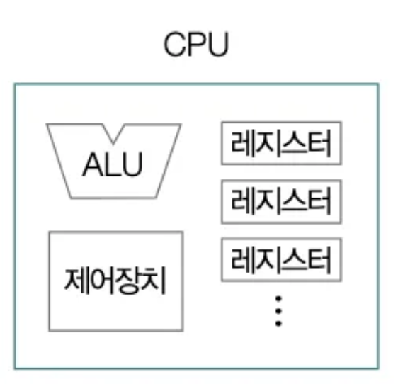
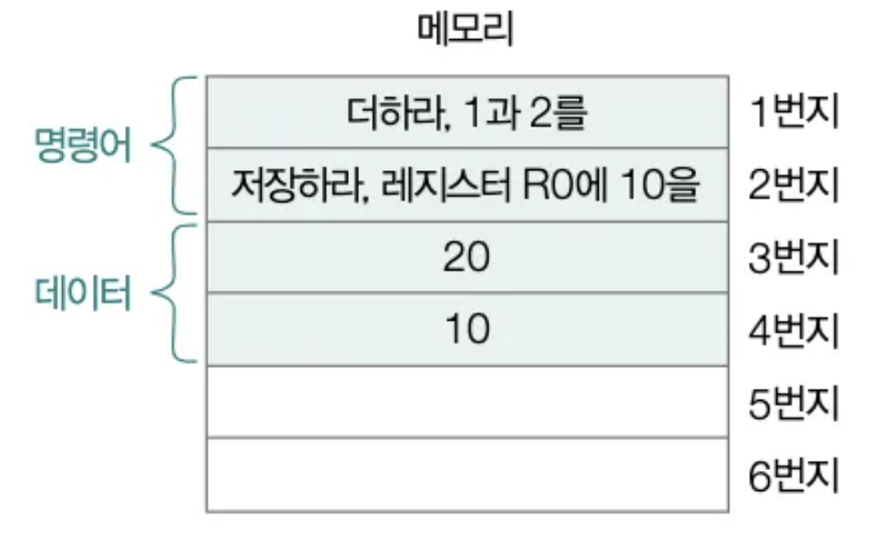
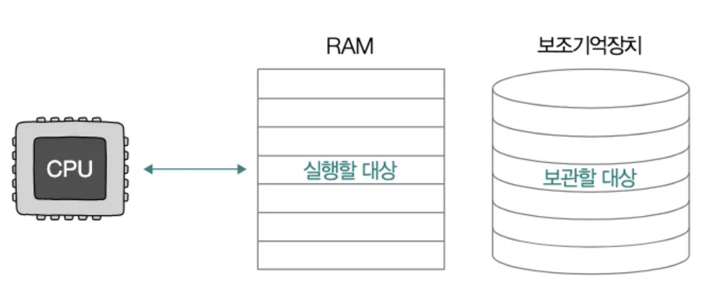
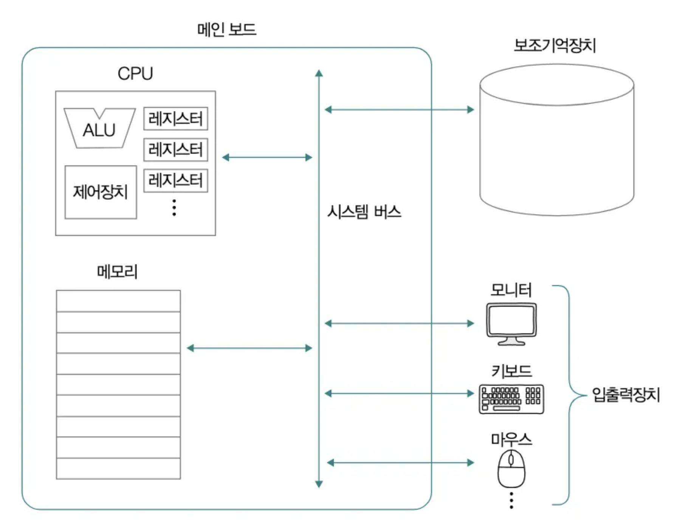
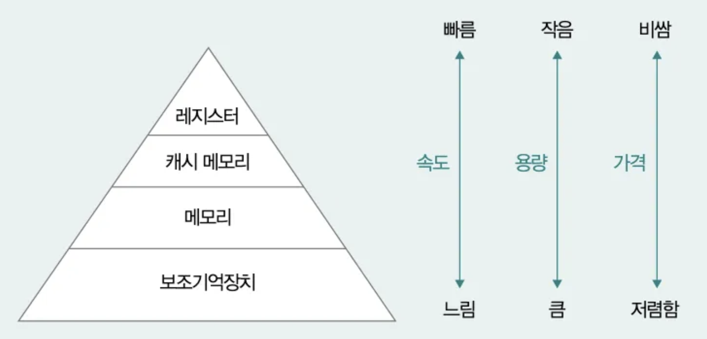
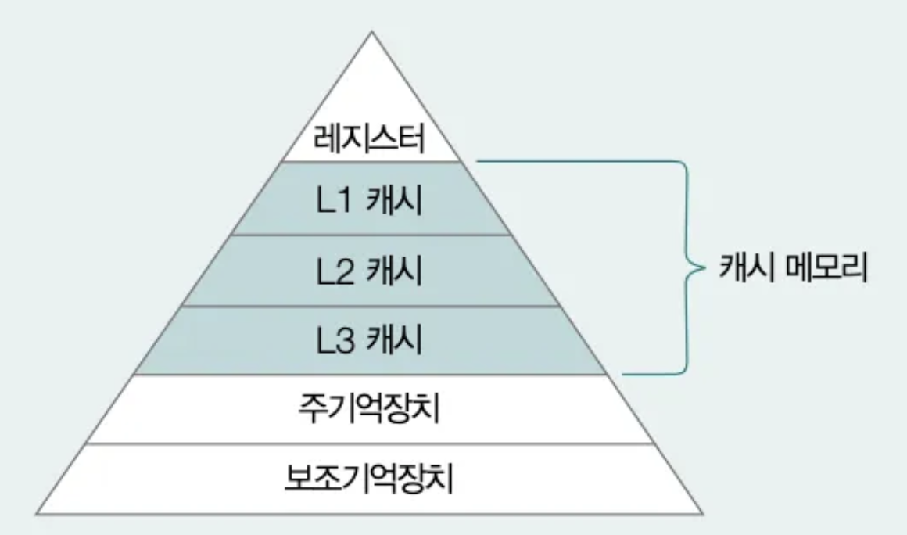

## 컴퓨터가 이해하는 정보

### **컴퓨터는 프로그래밍 언어를 직접 이해하지 못한다.**

- 자바, C++, 파이썬 등은 사람이 이해하기 쉽게 만든 언어일 뿐입니다.
- 컴퓨터가 실제로 이해하는 것은 데이터와 명령어입니다.
- 우리가 작성하는 소스코드는 내부적으로 데이터와 명령어 형태로 변환된 후 실행됩니다.

### **데이터와 명령어의 관계**

- `데이터` : 숫자, 문자, 이미지 등 정적인 정보로, 컴퓨터와 주고받는 정보나 컴퓨터에 저장된 정보 자체를 의미합니다. 이는 명령어에 종속된 정보입니다.
    - 예: 1, hello world, cat.jpg
- `명령어` : 데이터를 처리하거나 조작하라는 지시로, 데이터를 활용하는 정보입니다.
    - 예: 출력하라, 저장하라
- 명령어는 데이터를 대상으로 하며, 데이터는 명령어의 재료가 됩니다.

### 컴퓨터는 0과 1로 모든 것을 표현

- 컴퓨터는 기본적으로 0과 1만을 이해할 수 있으므로, 데이터와 명령어 모두 이진수로 구성됩니다.
- 이 데이터를 해석하고 실행하는 주체는 CPU입니다.

### **CPU와 명령어의 관계**

- CPU는 명령어를 해석하고 실행하는 장치입니다.
- CPU의 종류에 따라 실행 가능한 명령어가 달라질 수 있으며, 세부적인 처리 방식도 다를 수 있습니다.
- 하지만 보편적으로 사용되는 명령어들은 대부분의 CPU에서 유사하게 사용됩니다.

 

> Fetch - Decode - Execute 사이클 (명령어 사이클)
> - Fetch (가져오기): 메모리에서 명령어를 가져옵니다.
> - Decode (해석): 명령어를 해석합니다.
> - Execute (실행): ALU나 다른 장치를 통해 명령어 수행합니다.
>

## 컴퓨터의 핵심 부품

### **공통 핵심 부품**

- 노트북, 데스크톱, 서버 등 어떤 종류의 컴퓨터든 기본 구조는 유사합니다.
- 핵심 부품: `CPU(중앙처리장치)`, `메모리(주기억장치, 캐시 메모리)`, `보조기억장치(예: 하드디스크)`, `입출력장치`

### **CPU (Central Processing Unit)**

- CPU는 데이터를 읽고, 해석하고, 실행하는 부품으로 사람의 두뇌에 비유됩니다.
- 매우 정교한 구조를 가지고 있지만, 개발자가 주로 집중하는 부분은 다음 두 가지입니다:
    1. `주요 구성 요소`
    2. `빠른 명령어 처리를 위한 기술`
    
    
    

### CPU의 주요 구성 요소

- `산술논리연산장치 (ALU, Arithmetic Logic Unit)`
    - 사칙연산 및 논리연산을 담당하는 회로.
    - CPU가 명령어를 실제로 계산/처리하는 부분.
- `제어장치 (CU, Control Unit)`
    - 명령어를 해석하고, 각 구성 요소에 제어 신호를 전달.
    - 예: 메모리에서 데이터 읽기, 연산 지시, 입출력 장치로 데이터 전송 등.
- `레지스터 (Register)`
    - CPU 내부의 초고속 임시 저장소.
    - 연산 중간 결과나 명령어 실행에 필요한 데이터를 저장.
    - 여러 종류가 있으며, 각 레지스터는 고유한 이름과 역할을 가짐.
- 가장 중요한 요소는 레지스터입니다.
- CPU가 실행하는 모든 명령어는 반드시 레지스터에 저장되며, 레지스터 값만 잘 관찰해도 프로그램의 실행 과정을 파악할 수 있습니다.

### **메모리와 캐시 메모리**

- 메모리(Memory)는 일반적으로 RAM을 의미하며, 컴퓨터의 주기억장치 역할을 합니다.
    - 메인 메모리 역할을 하는 하드웨어에는 `RAM`과 `ROM`이 있지만, 보통 "메모리"라고 하면 RAM을 가리킵니다.
- 프로그램이 실행되기 위해서는 해당 명령어와 데이터가 메모리에 올라가 있어야 합니다.

 

> **ROM (Read-Only Memory)**
> 
> - 읽기 전용 메모리로, 일반적으로 사용자가 데이터를 수정할 수 없습니다.
> - 비휘발성 저장장치: 전원이 꺼져도 데이터가 유지됩니다.
> - 주로 컴퓨터의 부팅 시 필요한 정보(펌웨어)를 저장하는 용도로 사용됩니다.
> 
> **ROM의 역할**
> 
> - 컴퓨터를 켰을 때 가장 먼저 실행되는 `BIOS`나 `UEFI` 같은 프로그램이 저장되어 있습니다.
> - 하드웨어를 초기화하고, 운영체제를 메모리로 불러오는 작업(부트스트랩)을 수행합니다.

### 메모리의 주소

- CPU는 주소(Address)를 통해 메모리에 저장된 특정 위치의 데이터를 읽거나 씁니다.
- 실행 중인 데이터는 반드시 메모리에 존재해야 하며, CPU는 해당 주소를 통해 원하는 데이터를 빠르게 접근합니다.

    

 

> 예를 들어 int x = 10;이라는 코드가 실행되면, 컴퓨터는 메모리에서 변수 x를 저장할 공간을 확보하고 그 위치에 숫자 10을 저장합니다. 여기서 x는 사람이 이해하기 위한 이름일 뿐이며, 컴퓨터는 실제로는 0x1004와 같은 메모리 주소를 사용합니다.
> 
> 
> CPU는 변수 이름이 아니라, 그 변수에 해당하는 메모리 주소를 기준으로 데이터를 읽고 씁니다. 예를 들어 x + 5라는 연산을 하게 되면, CPU는 먼저 변수 x의 주소에 있는 값을 메모리에서 읽어와서, 여기에 5를 더한 다음 결과를 저장하거나 출력하는 방식으로 동작합니다.
> 

### 메모리의 휘발성

- RAM은 휘발성(Volatile) 저장장치이므로, 전원이 꺼지면 저장된 데이터가 모두 사라집니다.
    - `휘발성`: 전원 공급이 중단되면 데이터가 사라지는 특성

### **캐시 메모리 (Cache Memory)**

- 캐시 메모리는 CPU와 메모리 사이에 위치한 고속 임시 저장장치입니다.
- CPU가 자주 사용하는 데이터나 명령어를 미리 저장해두고 빠르게 접근할 수 있도록 합니다.
- 종류에 따라 CPU 내부 또는 외부에 위치할 수 있으며, 대부분의 시스템에서는 하나 이상의 L1, L2, L3 등의 캐시 계층이 존재합니다.

 

> 캐시 메모리는 CPU와 메모리 사이에 있는 고속 임시 저장장치로, CPU가 자주 사용하는 데이터를 미리 저장해두었다가 빠르게 꺼내 쓸 수 있도록 도와줍니다. 메모리는 속도가 느리기 때문에, 캐시를 통해 CPU의 작업 속도를 높일 수 있습니다. 캐시는 사용 빈도가 높은 데이터를 우선적으로 저장하고, CPU는 먼저 캐시를 확인한 뒤 없을 경우에만 메모리로 접근합니다. 이렇게 해서 전체 성능을 향상시키는 역할을 한다.
> 

### **보조기억장치 (Secondary Storage)**

- RAM의 휘발성을 보완하는 비휘발성 저장장치로, 전원이 꺼져도 데이터가 유지됩니다.
- 대표적인 예시:
    - `CD-ROM`, `DVD`, `HDD`, `플래시 메모리 (SSD, USB)`, `플로피 디스크`, `SD 카드` 등.
- 최근에는 HDD와 플래시 메모리 기반 SSD가 주로 사용됩니다.
- 메모리(RAM)가 현재 실행 중인 프로그램을 저장한다면, 보조기억장치는 프로그램이나 데이터를 장기 보관하는 역할을 합니다.
- 어떤 프로그램이 실행되려면, 반드시 보조기억장치에 저장된 프로그램이 메모리로 복사되어야 합니다.

### 입출력장치 (I/O Device)

- 컴퓨터 외부와 정보를 주고받는 장치들로, 컴퓨터와 사용자의 상호작용을 가능하게 합니다.
    - 입력장치: 마우스, 키보드, 마이크 등
    - 출력장치: 모니터, 스피커, 프린터 등
- 보조기억장치도 넓은 의미에서 입출력장치에 포함됩니다.
    - 메모리를 보조하며 데이터를 읽고 쓰는 기능을 수행합니다.
    - 이처럼 컴퓨터 외부와 연결되어 작동하기 때문에 주변장치(Peripheral Device)로도 분류됩니다.

### 메인보드와 버스 (Mainboard & Bus)

- 메인보드(Motherboard)
    - 컴퓨터 내부의 주요 부품(CPU, 메모리, 저장장치 등)을 연결하는 **기판**.
- 버스(Bus)
    - 컴퓨터 내부 부품 간 데이터를 전달하는 통로.
    - 다양한 종류가 있으나, CPU, 메모리, 입출력장치 등을 연결하는 시스템 버스가 가장 핵심적입니다.
    - 메인보드를 통해 모든 주요 부품은 이 버스를 통해 서로 통신합니다.

    

## 저장장치의 계층 구조

- 저장장치는 속도, 용량, 비용 등의 요소에 따라 계층적으로 구성됩니다.
- CPU에 가까울수록 속도가 빠르지만 용량이 작고 비용이 비쌉니다.
- 하위 계층으로 갈수록 속도는 느려지지만 대용량 저장과 장기 보관이 가능합니다.
- 각 저장장치는 고유한 역할과 특성을 가지고 있으므로, 계층 구조를 활용해 전체적인 성능과 효율을 최적화합니다.